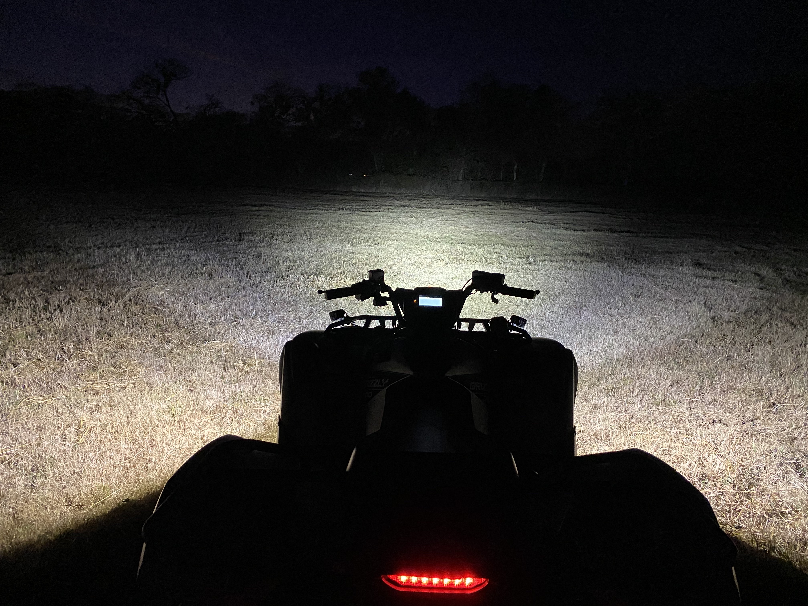

# ATV Control PCB

This board was designed to act as a relay for two LED (V1 and V2) lights up to 7.5A each and a horn (H) up to 20A. Each LED Output has a control switch input and indicator LED output. When the Ignition input is on (12V) indicates the ATV is running so the Reverse input will turn LED V2 output on when at 12V and the High Beam input will turn LED V1 output on when at 12V. Turning Ignition off (0V) will turn off all LED outptus (V1 and V2). The control switches allows manual control the LED lights even when the ATV off. When you turn a LED on with a control switch the LED light will remain on for a configurable amount of time (1-20 minutes). This delay off will prevent the battery from being discharged.

The horn is controlled by a switch just like the LED outputs but it has three indicator LEDs (Red, Green, and Blue). When the horn control switch is pressed any currently on LED outputs (V1 or V2) will be turned off to reduce overall current throught the board. The horn will not work if Ignition is not on (12V).

## Status and Testing

* Rev 1.0 has been ordered and tested.
  * You can order parts from Mouser using this [shared BOM](https://www.mouser.com/ProjectManager/ProjectDetail.aspx?AccessID=3e10d07292).
  * You can order the PCB from [OSH Park](https://oshpark.com/shared_projects/YVj5Y8EP).

## Board Preview

 

## Notes

* This board must have a 20A fuse or other safety device on the input.
* The Reverse Input is configured for my 2020 Yamaha Grizzly 700. The reverse switch is connected to ground when ATV is in reverse, otherwise it is pulled up to 12V by the Engine Control Unit. R17 is used to pulldown this input to prevent a floating input from causing problems. However this pulldown is a high enough impedance to not affect the pullup in the Engine Control Unit. You will need to adjust this input to match your specific ATV.
* The board's current usage is about than 0.25 mA when idle. This represents a small but never the less non-zero current draw on the ATV's battery even when the ignition is off. My ATV is used frequently so this is not an issue but if you plan on storing the ATV long term you should be using a trickle charger to keep the battery topped off. Or pull that 20 A fuse you added to the 12V input to this PCB.
* I used High-Side switch from Infineon for all the high current outputs. These chips are designed for automotive environments to drive resistive, capacitive, and inductive loads while providing over current, over temperature, over voltage, and reverse polarity protections. I also used these High-Side Switches for the indicator LEDs even though it is a bit overkill.
* The Horn circuit is a relatively high current at 20A. There is missing solder mask on the bottom of the PCB. It is expected that additional solder will be placed on this section to improve current handling. You should also plan on adding a 16 AWG wire between the GND input and the H- connections.
* This PCB design expects 2 oz copper for both sides.
* Assembling this PCB will require a reflow oven or hot air. [Whizoo](http://www.whizoo.com/) sells a nice kit to make your own reflow oven.
* This PCB design uses my custom libraries available here [Mike's KiCad Libraries](https://github.com/mikelawrence/KiCad-Libraries).
* PCB is designed in [KiCad](http://kicad-pcb.org) which is a great free EDA toolset.
* For Bill of Materials generation I use my version of [KiBoM](https://github.com/mikelawrence/KiBoM) forked from [SchrodingersGat](https://github.com/SchrodingersGat/KiBoM).

## Software

The microcontroller is a Atmel/Microchip XMega8E5. Software is written in C using the free [Microchip Studio for AVR](https://www.microchip.com/mplab/microchip-studio) free cross compiler and development environment. My normal AVR debugging tool is [Atmel-ICE](https://www.microchip.com/DevelopmentTools/ProductDetails/atatmel-ice). You can get it for as low as $62 in the form of a board from Digikey or Mouser. Instead of the standard programming header I use the Tag-Connect cable and it's space saving [footprint](https://www.tag-connect.com/product/tc2030-nl-fp-footprint). [This](https://www.tag-connect.com/product/tc2030-icespi-nl-no-leg-cable-for-use-with-atmel-ice) is Tag-Connect cable I use with the Atmel-ICE.

## Board Installation

I use Sugru moldable silicone to encapsulate this PCB to prevent water damage.

## End Result

The push button switches were installed in the center headlight cluster. Looking from the front the center pushbutton is the horn. The two push buttons on the right control the LED lights. The two buttons on the left are buttons for the Homelink controller ([60-HMLKV5BLK](https://www.amazon.com/gp/product/B00A79G9FY/ref=ppx_yo_dt_b_search_asin_title?ie=UTF8&psc=1)) so I can control my front gate and one garage door. This is not part of the ATV Control PCB.

For the front of the ATV I installed a Black Oak [10" Dual Row, 100W Flood LED Light Bar](https://www.blackoakled.com/collections/double-row-led/products/10-two-row-led-light-bar-combination-beam-pattern-white-osram) and two Black Oak [2" Single Row, 20W Scene LED Light Bars](https://www.blackoakled.com/products/new-2-inch-single-row-series-led-light-bar-with-scene-optics?_pos=6&_sid=0f2b0b32f&_ss=r). All three LED Light Bars draw just under 7 A which is just below the maximum current of 7.5 A for that output. I used Axia Alloy mounts for the LED Light Bars. They are expensive but look good and are strong at the same time. The front rack on the 2020 Grizzly is 7/8" in diameter.

I added a Black Oak [2" 40W Diffused LED Pod Light](https://www.blackoakled.com/products/new-2-inch-diffused-pod-light-powerful-turret-style-pod-40w-cree-xm-l2?_pos=1&_sid=a00cf89ab&_ss=r) to the rear of the ATV mainly as a backup light. This LED Light draws 4.1 A which is just fine for the LED outputs. The accessory brush guard has a nice mounting point for this light right in the middle and well protected.

Here is a picture taken at night just after dusk. This is the front shot with all three light bars on. The fence line is 200 ft away and the shot is from behind the ATV. The slightly different color temperature on the left and right shows how the small light bars increase the visiblity on the sides. I'm happy with the results.

This the rear shot again slightly after dusk with the rear pointed at the same fence line but about 25 ft away. The diffuse optics make the light more even, less sharp. It probably decreases the overall light output for a more pleasing distrubution. You loose distance for more even coverage.

