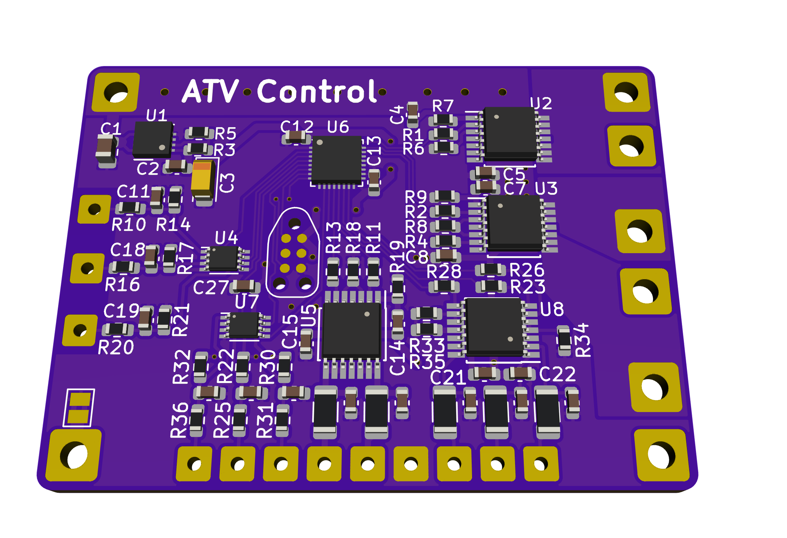
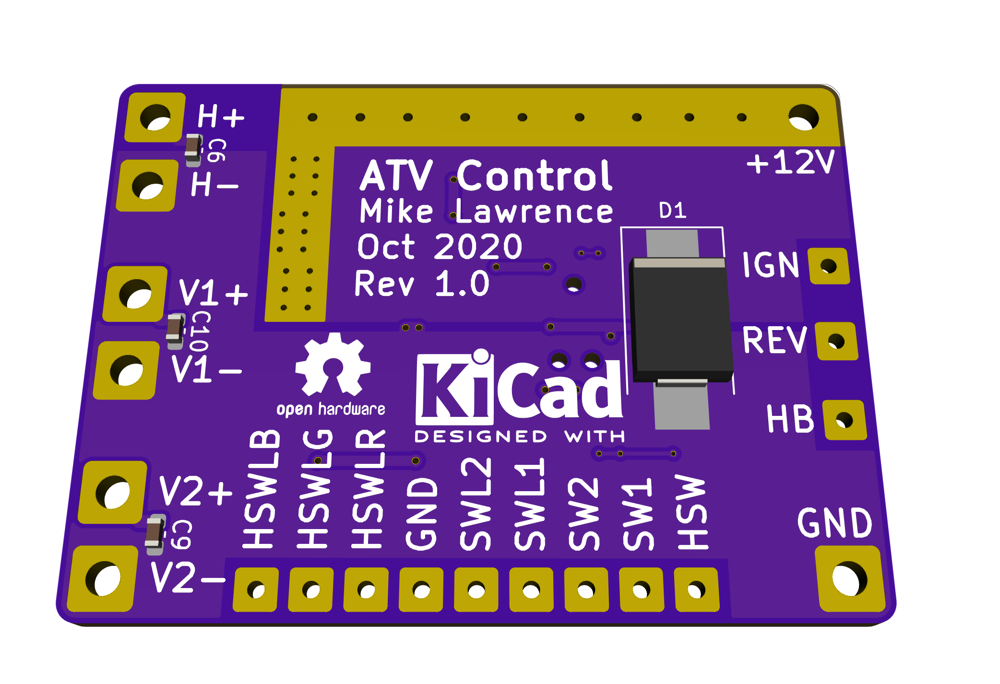

# ATV Control PCB

This board was designed to act as a relay for two LED (V1 and V2) lights up to 7.5A each and a horn (H) up to 20A. Each LED Output has a control switch input and indicator LED output. When the Ignition input is on (12V) indicates the ATV is running so the Reverse input will turn LED V2 output on when at 12V and the High Beam input will turn LED V1 output on when at 12V. Turning Ignition off (0V) will turn off all LED outptus (V1 and V2). The control switches allows manual control the LED lights even when the ATV off. When you turn a LED on with a control switch the LED light will remain on for a configurable amount of time (1-20 minutes). This delay off will prevent the battery from being discharged.

The horn is controlled by a switch just like the LED outputs but it has three indicator LEDs (Red, Green, and Blue). When the horn control switch is pressed any currently on LED outputs (V1 or V2) will be turned off to reduce overall current throught the board. The horn will not work if Ignition is not on (12V).

## Status and Testing

* Rev 1.0 has been ordered and tested.
  * You can order parts from Mouser using this [shared BOM](https://www.mouser.com/ProjectManager/ProjectDetail.aspx?AccessID=3e10d07292).
  * You can order the PCB from [OSH Park](https://oshpark.com/shared_projects/YVj5Y8EP).

## Board Preview

## Notes

* This board should have a 20A fuse on the input for safety.
* The board's current usage is about than 0.25 mA when idle. This represents a small but never the less non-zero current draw on the ATV's battery even when the ignition is off. My ATV is used frequently so this is not an issue but if you plan on storing the ATV long term you should be using a trickle charger to keep the battery topped off.
* I used High-Side switch from Infineon for all the high current outputs. These chips are designed for automotive environments to drive resitive, capacitive, and inductive loads while providing over current, over temperature, over voltage, and reverse polarity protections. I also used these High-Side Switches for the indicator LEDs even though it is a bit overkill.
* The Horn circuit is a realtively high current at 20A. There is missing solder mask on the bottom of the PCB. It is expected that additional solder will be placed on this section to improve current handling. You should also plan on adding a 16 AWG wire between the GND input and the H- connections.
* This PCB design expects 2 oz copper for both sides.
* Assembling the this PCB will require a reflow oven or hot air. [Whizoo](http://www.whizoo.com/) sells a nice kit to make your own reflow oven.
* This PCB design uses my custom libraries available here [Mike's KiCad Libraries](https://github.com/mikelawrence/KiCad-Libraries).
* PCB is designed in [KiCad](http://kicad-pcb.org) which is a great free EDA toolset.
* For Bill of Materials generation I use my version of [KiBoM](https://github.com/mikelawrence/KiBoM) forked from [SchrodingersGat](https://github.com/SchrodingersGat/KiBoM).

## Software

The microcontroller is a Atmel/Microchip XMega8E5. Software is written in C using the free [Microchip Studio for AVR](https://www.microchip.com/mplab/microchip-studio) free cross compiler and development environment. My normal AVR debugging tool is [Atmel-ICE](https://www.microchip.com/DevelopmentTools/ProductDetails/atatmel-ice). You can get it for as low as $62 in the form of a board from Digikey or Mouser. Instead of the standard programming header I use the Tag-Connect cable and it's space saving [footprint](https://www.tag-connect.com/product/tc2030-nl-fp-footprint). [This](https://www.tag-connect.com/product/tc2030-icespi-nl-no-leg-cable-for-use-with-atmel-ice) is Tag-Connect cable I use with the Atmel-ICE.

## Protection Against the Elements

I use Sugru moldable silicone to encapsulate this PCB to prevent water damage.

